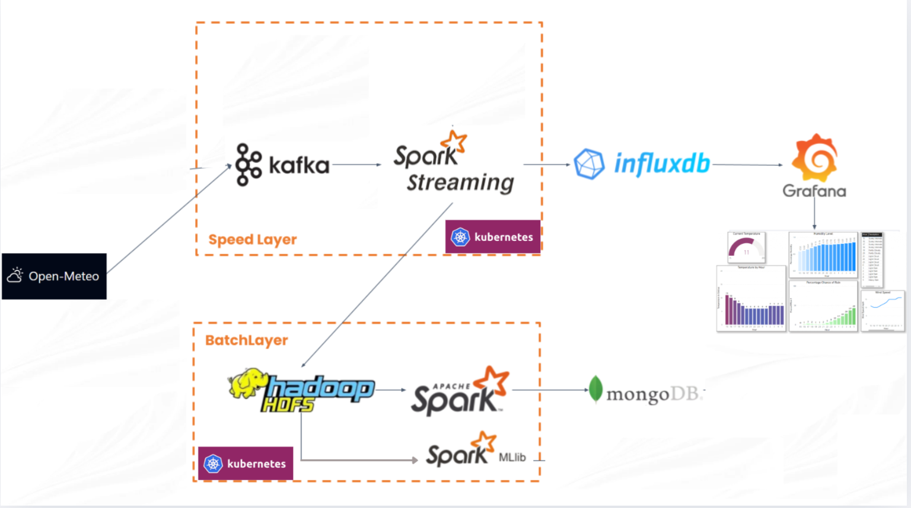

# Group 8: Big Data Project

## Project Overview

Our project implements a comprehensive Big Data pipeline using the **Lambda Architecture** to collect, process, and visualize real-time weather data for 20 major cities globally. The system includes both continuous streams (Speed Layer) while saves historical records for batch analysis (Batch Layer).

---

## 1. General Pipeline

The architecture follows a hybrid Lambda pattern incorporating real-time streaming and batch processing.

---

## 2. File Explanations

The explanations for each file in our source code is as followed:

### K8s Folder (for k8s deployment)

- **Folder `kafka`**:
  - **`kafdrop-values.yaml`**: Configuration for _Kafdrop's pod_ such as image, brokerConnect, NodePort, etc.
  - **`values.yaml`**: Overwrite configuration for release chart `bitnami/kafka`.
- **Folder `spark`**:
  - **`batch-configmap.yaml`**: Stores configuration for the batch `write-to-mongodb.py` job, such as `HDFS_OUTPUT_PATH` and `MONGODB_URI`.
  - **`batch-deployment.yaml`**: Defines the Deployment for the Spark batch job, which runs `write-to-mongodb.py` in a continuous loop.
  - **`consumer-configmap.yaml`**: Stores non-sensitive configuration for the streaming consumer, including Kafka broker addresses and InfluxDB endpoints.
  - **`consumer-deployment.yaml`**: Defines the Deployment for the Spark Streaming consumer, configured with specific resource limits and packages.
  - **`consumer-secret.yaml`**: Stores sensitive credentials (base64 encoded) such as `INFLUXDB_TOKEN` for the spark-submit-streaming pod.
  - **`ml-job.yaml`**: Defines the machine learning **Job**. This pod is stated as **Job** type, as it runs once without automatically rerunning.
- **Folder `influxdb`**:
  - **`secret.yaml`**: Stores the initial administrator credentials, organization, bucket, and API tokens for InfluxDB setup.
  - **`statefulset.yaml`**: Defines the StatefulSet for InfluxDB with persistent storage and the Service for internal cluster access.
- **Folder `grafana`**:
  - **`configmap-datasource.yaml`**: InfluxDB connection in Grafana using the secure token.
  - **`deployment.yaml`**: Defines the Grafana Deployment, NodePort Service, and PersistentVolumeClaim for dashboard storage.
  - **`secret.yaml`**: Stores the default `admin` credentials for the Grafana dashboard login.
- **Folder `hdfs`**:
  - **`configmap.yaml`**: Defines Hadoop environment variables (e.g., `YARN_SITE`, `MAPRED_SITE`).
  - **`hadoop-config-files.yaml`**: Stores the actual `core-site.xml` and `hdfs-site.xml` configuration files injected into the containers.
  - **`hdfs-statefulsets.yaml`**: Defines the StatefulSets for both the HDFS NameNode (with formatting logic) and DataNode.
  - **`services.yaml`**: Defines the Services for accessing HDFS (RPC/WebUI) and YARN components.
  - **`yarn-deployments.yaml`**: Defines the Deployments for the YARN ResourceManager and NodeManager.
- **Folder `mongodb`**:
  - **`statefulset.yaml`**: Defines the StatefulSet and Service for MongoDB 7.0 with persistent storage.

### Other Files in Root Directory
- **Folder `producer`**:
    - **`producer.py`**: The entry point for data ingestion. It initializes a `producer` with `enable.idempotence=True` for reliability. It spawns a separate thread for each of the 20 cities to ensure concurrent data fetching.
    - **`producer_utils_v2.py`**: Contains the `retrieve_weather_data` function to fetches data from the API
    - **`producer_utils.py`**: First version of our 'retrieve_weather_data' function with less data.
- **Folder `consumer`**:
  - **`consumer.py`**: A Spark Structured Streaming application. It defines the strict schema (`StructType`) for weather data. It uses `foreachBatch` to handle the dual-sink logic (writing to InfluxDB and HDFS simultaneously) within the same micro-batch.
  - **`write-to-mongodb.py`**: The batch processing script. It reads Parquet data from HDFS, performs data cleaning (`dropDuplicates`), calculates aggregations (Mean, Max, Min), and writes the results to MongoDB using the `mongo-spark-connector`.
  - **`ml-training.py`**: The simple Linear Regression training script with data from HDFS. It fetches data from HDFS, trains, and saves the model for further development.

- **`docker-compose.yaml`**: Developed during our phase 2 (docker compose). This configuration file used for deploying and testing the full pipeline on a local Docker environment before migrating into Kubernetes.
- **`spark.Dockerfile`**: Instruction file to build the custom Spark image with Python dependencies for processing jobs.

## 3. Development Strategy
The project deployment strategy is listed as followed:

- **Phase 1 - Data Acquisition:** Developed Python scripts to ensure stable API connection and data formatting[cite: 633].
- **Phase 2 - Docker Compose:** Deployed the full stack using `docker-compose.yaml` to verify component connectivity (networking, volumes) in a controlled environment.
- **Phase 3 - Kubernetes Migration**:
  - Converted Docker Compose services to K8s environment.
  - Used **Helm** for managing the complex Kafka installation.
  - Deployed **StatefulSets** for stateful components (HDFS, InfluxDB, Mongo).
  - Deployed **Deployments** for stateless compute (Spark jobs).
  - Deployed a simple Linear Regression model using collected data.